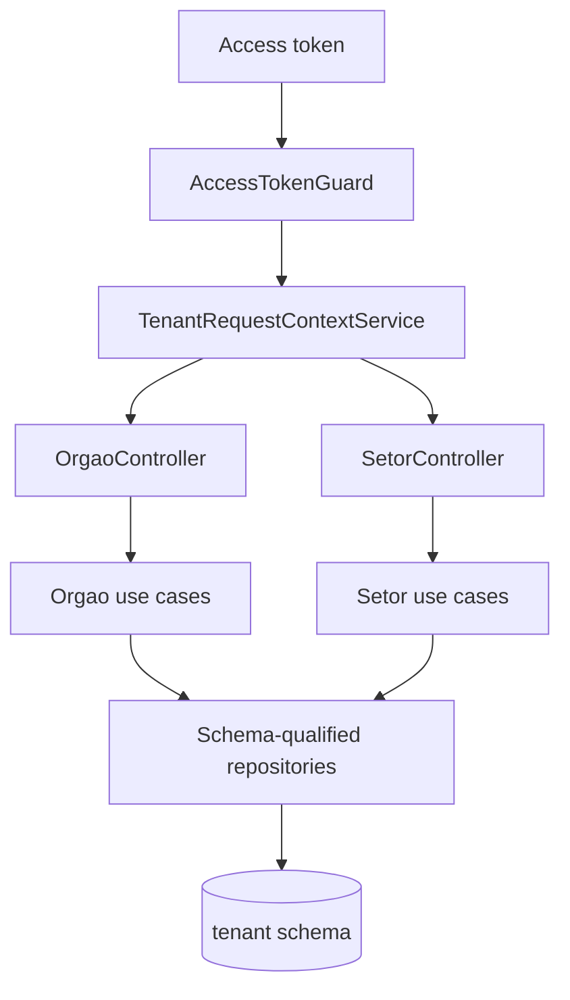

# Cadastros de Orgaos e Setores Design

**Spec**: `.specs/features/cadastros_orgaos_setores/spec.md`
**Status**: Approved

## Architecture Overview

Orgaos e setores seguem o mesmo desenho de localidades: os dados vivem somente
no schema do tenant resolvido pelo contexto verificado da request. Nenhum
endpoint aceita schema ou tenant no payload.



## Code Reuse Analysis

| Component | Location | How to Use |
| --- | --- | --- |
| Tenant request context | `src/core/multitenancy/tenant_request_context.service.ts` | Establish the trusted tenant schema before use cases run. |
| Tenant schema bootstrap | `src/core/multitenancy/tenant_identity_schema.ts` | Already creates `orgaos` and `setores` with tenant-local FKs. |
| Localidades module pattern | `src/modules/localidades/` | Reuse entity, mapper, repository, service, DTO and controller patterns. |
| Error code registry | `src/core/constants/error_code.constants.ts` | Add stable frontend-facing codes for orgao and setor failures. |

## Components

### Orgao Domain

- **Purpose**: Validate orgao fields and update only supplied mutable fields.
- **Location**: `src/modules/orgaos/domain/`
- **Interfaces**: static `create`, `fromData`, `update`, getters and `toObject`.
- **Dependencies**: `TipoOrgao` enum and module domain exception.
- **Reuses**: Localidade entity style.

### Setor Domain

- **Purpose**: Validate setor fields and update only supplied mutable fields.
- **Location**: `src/modules/orgaos/domain/`
- **Interfaces**: static `create`, `fromData`, `update`, getters and `toObject`.
- **Dependencies**: module domain exception.
- **Reuses**: Localidade entity style.

### Tenant Repositories

- **Purpose**: Persist, list and lookup orgaos/setores through explicit schema-qualified SQL.
- **Location**: `src/modules/orgaos/infra/`
- **Interfaces**: `save`, `findById`, `findAll`; setor repository also lists by `orgaoId`.
- **Dependencies**: `DataSource` and `TenantContext`.
- **Reuses**: Localidade repository pattern.

### Application Use Cases

- **Purpose**: Enforce role rules and validate tenant-local relationships before persistence.
- **Location**: `src/modules/orgaos/application/`
- **Interfaces**: create/list/update orgao; create/list/update setor.
- **Dependencies**: orgao, setor and localidade repositories.
- **Reuses**: Localidade service authorization pattern.

### HTTP Controllers

- **Purpose**: Validate primitive DTO payloads, establish request tenant context and map application failures to HTTP.
- **Location**: `src/modules/orgaos/controller/`
- **Interfaces**: `/api/orgaos` and `/api/orgaos/:orgaoId/setores`.
- **Dependencies**: use case symbols and `TenantRequestContextService`.
- **Reuses**: Localidade controller pattern.

## Data Models

### Orgao

```typescript
interface Orgao {
  id: string;
  localidadeId: string;
  nome: string;
  sigla: string | null;
  tipo: 'SECRETARIA' | 'AUTARQUIA' | 'FUNDACAO' | 'EMPRESA_PUBLICA' | null;
  responsavel: string | null;
  email: string | null;
  telefone: string | null;
  ativo: boolean;
  createdAt: Date;
  updatedAt: Date;
}
```

**Relationships**: belongs to one tenant-local localidade.

### Setor

```typescript
interface Setor {
  id: string;
  orgaoId: string;
  nome: string;
  ativo: boolean;
  createdAt: Date;
  updatedAt: Date;
}
```

**Relationships**: belongs to one tenant-local orgao.

## Error Handling Strategy

| Error Scenario | Handling | User Impact |
| --- | --- | --- |
| Invalid orgao name, type, email or FK shape | Domain/service exception with registered 400 code | HTTP 400 |
| Invalid setor name or FK shape | Domain/service exception with registered 400 code | HTTP 400 |
| Localidade, orgao or setor absent in verified tenant | Repository/service exception with registered 404 code | HTTP 404 |
| Missing tenant context or unauthorized role | Service/context exception with 401 or 403 | HTTP 401/403 before persistence |
| Database failure | Repository exception with registered 500 code | HTTP 500 |

## Risks & Concerns

| Concern | Location (file:line) | Impact | Mitigation |
| --- | --- | --- | --- |
| Global lint has a pre-existing identity e2e lint issue in the current dirty tree. | `test/identity.e2e-spec.ts` | Full lint may fail outside this feature's diff. | Run targeted lint for touched modules and report the pre-existing global lint status separately. |
| Orgao/setor bootstrap is already bundled into the locality foundation migration. | `src/core/multitenancy/tenant_identity_schema.ts` | Duplicating a migration would create schema churn and conflict risk. | Treat provisioning as complete by evidence and cover orgao/setor table assertions in existing integration tests. |

## Tech Decisions

| Decision | Choice | Rationale |
| --- | --- | --- |
| Module placement | Use `src/modules/orgaos/` for both orgaos and nested setores. | Setores are always scoped by orgao in the public route. |
| Relationship validation | Use repositories to check tenant-local parent records before writes. | Foreign-tenant IDs resolve as not found in the current schema. |
