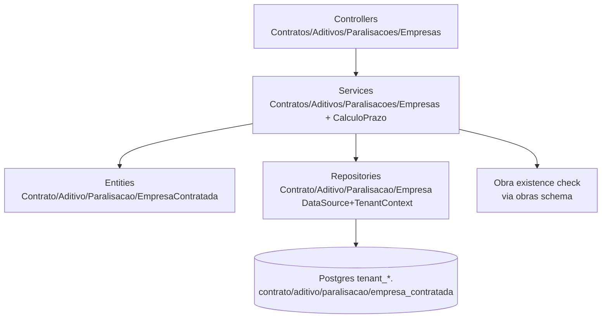

# Contratos Gestão Design

**Spec**: `.specs/features/contratos_gestao/spec.md`
**Status**: Draft

---

## Architecture Overview

Bounded context `Contratos` tenant-isolado, reproduzindo legado `ContratosContext` no padrão novo: `DataSource + TenantContext.require().schemaName + SQL direto` com `Either`. Centraliza cálculo de prazo em `calculo-prazo-execucao` puro (sem DB) e mantém contrato com 1:1 obra (unique obra_id).



Módulo novo `ContratosModule` (não estende ObrasModule) para isolamento; importa `CoreModule, AuthModule`.

---

## Code Reuse Analysis

| Component | Location | How to Use |
| --- | --- | --- |
| `TenantContext` + `TenantRequestContextService` | `src/core/multitenancy/*` | `tc.require().schemaName` em repos; `tc.run(user, fn)` em controllers |
| `BaseModelPrimaryColumnUuid` | `src/core/interface/base_model.ts` | Base para `EmpresaContratadaModel` etc. se tiver created_at/updated_at |
| `ObraRepository` pattern | `src/modules/obras/infra/repositories/obra.repository.ts` | Copiar `cols + ON CONFLICT + ds.query` com schema interpolado |
| Migration loop | `src/core/database/migrations/1781220000000-obras_guias_cadastros.ts` | `for (t of tenancies) {CREATE TABLE IF NOT EXISTS}` |
| `calculo-prazo-execucao` legado | `obras_backend_legado/src/modules/contratos/domain/calculo-prazo-execucao.service.ts` | Portar puro TS (sem TypeORM), testes unit legados como referência |
| `AccessTokenGuard` | `src/modules/auth/controller/access_token.guard.ts` | Guard em todas rotas |
| `ErrorCodeConstants` | `src/core/constants/error_code.constants.ts` | Adicionar `CONTRATO_*`, `ADITIVO_*`, `PARALISACAO_*`, `EMPRESA_*` |
| `PageEntity/PageMeta` | `src/core/pagination/*` | List contratos paginado |

## Components and Interfaces

### 1. Domain Entities (pure, sem TypeORM)

**Location**: `src/modules/contratos/domain/entities/`

- `ContratoEntity` — props `id, tenantId, obraId, empresaContratadaId, numero, objeto, dataAssinatura, fimVigencia, dataOs, tipoPrazoExecucao (DIAS|DATA), prazoExecucaoDias, prazoExecucaoData, fontes: ContratoFonteProps[], createdAt, updatedAt` — `static create` valida obraId/empresaId/numero/dataOs/tipo + `prazoExecucaoDias xor Data` + `fontes>=1`; `fromData` sem validação
- `AditivoEntity` — `id, tenantId, contratoId, numero (unique per contrato), tipo (PRAZO|VALOR|PRAZO_E_VALOR|FONTE|OUTROS), dataAssinatura, tipoPrazoExecucao?, prazoExecucaoDias?, prazoExecucaoData?, vigenciaAditivada?, observacoes?, fontes?, ordem?, createdAt`
- `ParalisacaoEntity` — `id, tenantId, contratoId, dataParalisacao, motivo, termoParalisacaoArquivoId, dataReinicio?, termoRetomadaArquivoId?, diasParados?, createdAt`
- `EmpresaContratadaEntity` — `id, tenantId, razaoSocial, nomeFantasia?, cnpj (14 dígitos, valida dígito), responsavel?, cargo?, email?, cep?, logradouro?, numero?, bairro?, cidade?, uf?, ativo, telefones[]`
- `calculo-prazo-execucao.ts` — funções puras portadas: `calcularPrazoFinalExecucao(Entrada)`, `avancarDiasContados`, `contarDiasContados`, `diffDiasCorridos`

Enums: `TipoAditivo`, `TipoPrazoExecucao` em `domain/enums/contratos.enums.ts` (port LEGADO).

### 2. Mappers (estáticos)

`src/modules/contratos/infra/mapper/*` — `ContratoMapper.toEntity(row)`, `AditivoMapper`, `ParalisacaoMapper`, `EmpresaMapper` — convertem `tenant_id→tenantId` etc.

### 3. Repositories

`src/modules/contratos/infra/repositories/*` com `DataSource+TenantContext`:

- `ContratoRepository`: `save(entity)`, `findById(id)`, `findByObra(obraId, pageOptions)`, `findByObraSingle(obraId)` (check unique), `assertObraExists(obraId)` via `SELECT FROM "${schema}"."obras" WHERE id AND deleted_at IS NULL`, `prazoFinal(id)` monta `EntradaCalculoPrazo` carregando aditivos/paralisacoes, `valores(id)` soma `contrato_fonte + aditivo_fonte`
- `AditivoRepository`: `save`, `listByContrato`, `findOne(id)` com tenant check
- `ParalisacaoRepository`: `save`, `listByContrato`, `findOne`, `reiniciar(id, dataReinicio)` → `UPDATE SET data_reinicio=$`
- `EmpresaContratadaRepository`: `save`, `list`, `findOne`, `existsCnpj(contratoId, cnpj)` unique per contrato

Todas queries schema-qualified `"${schema}"."tabela"`.

### 4. Services

`src/modules/contratos/application/*`:

- `ContratosService` — `create(param)`: valida `EmpresaContratada` pertence tenant, `obra` existe + `obraId` uniqueness (409), `EmpresaContratadaService` lookup, `ContratoEntity.create` → repo.save; `list`, `get`, `prazoFinal` (chama `calcularPrazoFinalExecucao`), `valores`
- `AditivosService` — `create(contratoId)`: `contrato` pertence tenant? `AditivoEntity.create` valida tipo/prazo; unique `numero` por contrato (catch 23505 → 409)
- `ParalisacoesService` — `create`, `reiniciar`: valida `dataReinicio > dataParalisacao` else 422, recalc via `calculo-prazo`
- `EmpresasContratadasService` — `create`: valida `cnpj` (regex + dígito verificador), unique per contrato-tenant, `save`

Todos retornam `AsyncResult<AppException,R>` e convertem `DomainException → left(ServiceException)`.

### 5. Controllers

`src/modules/contratos/controller/`:

- `ContratosController` `@Controller('api/contratos')` + `@Controller('api/obras/:obraId/contratos')`? — spec prevê `POST /api/contratos` com `obraId` no body + `GET /api/contratos?obraId=` e `GET /api/obras/:id/contratos`. Implementamos `POST /api/contratos`, `GET /api/contratos?obraId=&page&take`, `GET /api/contratos/:id`, `GET /api/contratos/:id/prazo-final`, `GET /api/contratos/:id/valores`
- `AditivosController` `@Controller('api/contratos/:contratoId/aditivos')` — `POST`, `GET`, `GET :id`, `PATCH :id`
- `ParalisacoesController` — `POST /api/contratos/:contratoId/paralisacoes`, `GET`, `POST /:id/reinicio {dataReinicio}`
- `EmpresasContratadasController` — `POST /api/empresas-contratadas`, `GET ?contratoId=`

Todos `@UseGuards(AccessTokenGuard)` + `TenantRequestContextService.run(user, fn)` + `left→HttpException`.

---

## Data Models

```sql
-- tenant schema, IF NOT EXISTS, criado por migration 1781230000000-contratos
CREATE TABLE "${s}"."empresa_contratada" (
  "id" uuid PRIMARY KEY,
  "tenant_id" uuid NOT NULL,
  "razao_social" varchar NOT NULL,
  "nome_fantasia" varchar,
  "cnpj" varchar NOT NULL,
  "responsavel" varchar, "cargo_responsavel" varchar, "email" varchar,
  "cep" varchar, "logradouro" varchar, "numero" varchar, "complemento" varchar, "bairro" varchar, "cidade" varchar, "uf" varchar(2),
  "ativo" boolean NOT NULL DEFAULT true,
  "created_at" timestamptz NOT NULL DEFAULT now(),
  "updated_at" timestamptz NOT NULL DEFAULT now()
);
CREATE TABLE "${s}"."empresa_contratada_telefone" (
  "id" uuid PRIMARY KEY, "tenant_id" uuid NOT NULL, "empresa_contratada_id" uuid NOT NULL REFERENCES "${s}"."empresa_contratada"(id) ON DELETE CASCADE, "numero" varchar NOT NULL, "created_at" timestamptz DEFAULT now()
);
CREATE TABLE "${s}"."contrato" (
  "id" uuid PRIMARY KEY, "tenant_id" uuid NOT NULL, "obra_id" uuid NOT NULL UNIQUE, "empresa_contratada_id" uuid NOT NULL, "numero" varchar NOT NULL, "objeto" text, "data_assinatura" date, "fim_vigencia" date, "data_os" date NOT NULL, "tipo_prazo_execucao" varchar NOT NULL, "prazo_execucao_dias" int, "prazo_execucao_data" date, "created_at" timestamptz DEFAULT now(), "updated_at" timestamptz DEFAULT now()
);
CREATE TABLE "${s}"."contrato_fonte" (
  "id" uuid PRIMARY KEY, "tenant_id" uuid NOT NULL, "contrato_id" uuid NOT NULL REFERENCES "${s}"."contrato"(id) ON DELETE CASCADE, "fonte_id" uuid NOT NULL, "valor" numeric(18,2) NOT NULL, "created_at" timestamptz DEFAULT now()
);
CREATE TABLE "${s}"."aditivo" (
  "id" uuid PRIMARY KEY, "tenant_id" uuid NOT NULL, "contrato_id" uuid NOT NULL REFERENCES "${s}"."contrato"(id) ON DELETE CASCADE, "numero" varchar NOT NULL, "tipo" varchar NOT NULL, "data_assinatura" date, "tipo_prazo_execucao" varchar, "prazo_execucao_dias" int, "prazo_execucao_data" date, "vigencia_aditivada" date, "observacoes" text, "created_at" timestamptz DEFAULT now(), UNIQUE(tenant_id, contrato_id, numero)
);
CREATE TABLE "${s}"."aditivo_fonte" (
  "id" uuid PRIMARY KEY, "tenant_id" uuid NOT NULL, "aditivo_id" uuid NOT NULL REFERENCES "${s}"."aditivo"(id) ON DELETE CASCADE, "fonte_id" uuid NOT NULL, "valor" numeric(18,2) NOT NULL
);
CREATE TABLE "${s}"."paralisacao" (
  "id" uuid PRIMARY KEY, "tenant_id" uuid NOT NULL, "contrato_id" uuid NOT NULL REFERENCES "${s}"."contrato"(id) ON DELETE CASCADE, "data_paralisacao" date NOT NULL, "motivo" text NOT NULL, "termo_paralisacao_arquivo_id" uuid NOT NULL, "data_reinicio" date, "termo_retomada_arquivo_id" uuid, "dias_parados" int, "created_at" timestamptz DEFAULT now(), "updated_at" timestamptz DEFAULT now()
);
```

Models TypeORM: `EmpresaContratadaModel`, `ContratoModel`, `ContratoFonteModel` etc. (estender `BaseModelPrimaryColumnUuid` ou manual PK quando só `created_at`).

---

## API Design

| Método | Rota | Auth | Body | OK |
|--------|------|------|------|----|
| `POST` | `/api/empresas-contratadas` | Bearer | `{razaoSocial, cnpj, nomeFantasia?, responsavel?, ... , telefones?}` | 201 |
| `GET` | `/api/empresas-contratadas?contratoId=` | Bearer | — | 200 paginado |
| `POST` | `/api/contratos` | Bearer | `{obraId, empresaContratadaId, numero, dataOs, tipoPrazoExecucao, prazoExecucaoDias|Data, objeto?, fontes:[{fonteId,valor}]}` | 201 |
| `GET` | `/api/contratos?obraId=&page&take` | Bearer | — | 200 |
| `GET` | `/api/obras/:obraId/contratos` | Bearer | — | alias list |
| `GET` | `/api/contratos/:id` | Bearer | — | 200 |
| `GET` | `/api/contratos/:id/prazo-final` | Bearer | — | `{prazoFinal, totalDias, diasBase, ...}` |
| `GET` | `/api/contratos/:id/valores` | Bearer | — | `{valorOriginal, valorAditivos, valorTotal}` |
| `POST` | `/api/contratos/:contratoId/aditivos` | Bearer | `{numero, tipo, tipoPrazoExecucao?, prazoExecucaoDias?, prazoExecucaoData?, observacoes?, fontes?}` | 201 |
| `GET` | `/api/contratos/:contratoId/aditivos` | Bearer | — | 200 |
| `POST` | `/api/contratos/:contratoId/paralisacoes` | Bearer | `{dataParalisacao, motivo, termoParalisacaoArquivoId}` | 201 |
| `GET` | `/api/contratos/:contratoId/paralisacoes` | Bearer | — | 200 |
| `POST` | `/api/contratos/:contratoId/paralisacoes/:id/reinicio` | Bearer | `{dataReinicio, termoRetomadaArquivoId?}` | 200 |

DTOs: `CriarContratoDto` (`@IsUUID obraId`, `@IsString numero`, `@IsDateString dataOs`, `@IsEnum TipoPrazoExecucao`, `@IsInt prazoExecucaoDias`, `@ValidateNested fontes ArrayMinSize 1`), `CriarAditivoDto`, `CriarParalisacaoDto`, `ReinicioParalisacaoDto`, `CriarEmpresaContratadaDto` (`@Matches CNPJ`).

---

## Risks & Concerns

| Concern | Mitigation |
|---------|------------|
| 1 contrato por obra unique `obra_id` race | Check `SELECT` + `UNIQUE` DB constraint; catch `23505` → 409 `CONTRATO_DUPLICATE_NUMERO` |
| `calculo-prazo` depende de flags `considerarSabado/Domingo` da obra | `ContratoRepository.prazoFinal` carrega `obras.considerar_sabado/domingo` e injeta em `EntradaCalculoPrazo` |
| `fonteId` tenant isolation | `SELECT FROM "${schema}"."fontes" WHERE id=$1 AND tenant_id=$2` antes de salvar contrato_fonte/aditivo_fonte |
| CNPJ validação dígito vs formato | `CnpjValidator` puro + regex; unique per contrato não global |
| Paralisacao aberta projeta até `dataReferencia` | `calcularPrazoFinalExecucao` recebe `dataReferencia = now()`; teste cobre aberta vs fechada |
| Migration em N schemas | Loop `tenancies`, `IF NOT EXISTS`, `down` DROP |

---

## Error Codes (add to `error_code.constants.ts`)

`CONTRATO_NOT_FOUND (404)`, `CONTRATO_DUPLICATE_NUMERO (409)`, `CONTRATO_INVALID_INPUT (400)`, `CONTRATO_REPOSITORY_FAILED (500)`, `ADITIVO_NOT_FOUND (404)`, `ADITIVO_DUPLICATE_NUMERO (409)`, `ADITIVO_INVALID_INPUT (400)`, `PARALISACAO_NOT_FOUND (404)`, `PARALISACAO_INVALID_REINICIO (422)`, `EMPRESA_CONTRATADA_NOT_FOUND (404)`, `EMPRESA_DUPLICATE_CNPJ (409)`, `EMPRESA_INVALID_CNPJ (400)`, `EMPRESA_REPOSITORY_FAILED (500)`, `FONTE_NOT_FOUND (422)`

---

## Module Wiring

`src/modules/contratos/contratos.module.ts`:

```ts
TypeOrmModule.forFeature([EmpresaContratadaModel, EmpresaTelefoneModel, ContratoModel, ContratoFonteModel, AditivoModel, AditivoFonteModel, ParalisacaoModel]),
providers: [
  {provide: EMPRESA_CONTRATADA_REPOSITORY, inject: [DataSource, TenantContext], useFactory: (ds,tc)=>new EmpresaRepo(ds,tc)},
  {provide: CONTRATO_REPOSITORY, inject: [DataSource, TenantContext], useFactory: (ds,tc)=>new ContratoRepo(ds,tc)},
  {provide: ADITIVO_REPOSITORY, ...},
  {provide: PARALISACAO_REPOSITORY, ...},
  {provide: CREATE_CONTRATO_SERVICE, inject: [CONTRATO_REPOSITORY, DataSource, TenantContext], useFactory: ...},
  {provide: ADITIVOS_SERVICE, inject: [ADITIVO_REPOSITORY, DataSource, TenantContext], ...},
  {provide: PARALISACOES_SERVICE, ...},
  {provide: EMPRESAS_CONTRATADAS_SERVICE, ...},
],
controllers: [ContratosController, AditivosController, ParalisacoesController, EmpresasContratadasController],
```

## Decisions

Conforma AD-001, AD-002; nenhuma nova AD.

