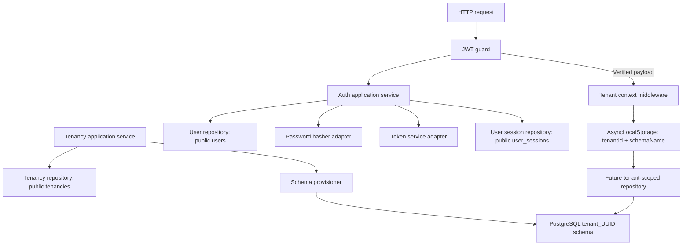

# Multi-tenant Identity Foundation Design

**Spec**: `.specs/features/multi_tenant_identity/spec.md`
**Status**: Draft

---

## Architecture Overview

The application will use one TypeORM `DataSource`. It owns public-schema migrations and global repositories. The authentication module issues a one-hour access token and a seven-day refresh token, then stores only the bcrypt hash of the refresh token in a global session record. A JWT guard accepts only verified access tokens, then middleware stores the trusted tenant ID and generated schema name in `AsyncLocalStorage`. Future tenant repositories receive this context and qualify their table paths with the resolved schema. They never accept a schema identifier from an HTTP request.



### Chosen approach

Use one global `DataSource` plus schema-qualified tenant repositories.

| Approach | Result | Decision |
| --- | --- | --- |
| DataSource and connection pool per tenant | Separate pools and dynamic lifecycle management | Rejected: pool count and migration coordination grow with tenants. |
| One DataSource with a trusted tenant context and qualified schema paths | One pool, explicit schema boundary, migration control remains central | Chosen. |
| Set PostgreSQL `search_path` for each request | Short repository queries | Rejected: connection reuse makes leakage prevention dependent on transaction discipline. |

## Code Reuse Analysis

### Existing Components to Leverage

| Component | Location | How to Use |
| --- | --- | --- |
| TypeORM CLI DataSource | `src/core/database/data-source.ts` | Register public models and migration globs; keep it as the TypeORM migration entry point. |
| Environment validation | `src/core/config/enviroment.ts` | Strengthen `SALT` and retain required `JWT_SECRET`. |
| Typed configuration access | `src/core/services/configuration.service.ts` | Inject configuration into infrastructure factories. |
| Core module | `src/core/core.module.ts` | Add TypeORM connection and tenant context infrastructure. |
| DDD conventions | `AGENTS.md`, `docs/architecture.md` | Use symbols, factories, `AsyncResult`, static mappers, and `useFactory` providers. |

### Integration Points

| System | Integration Method |
| --- | --- |
| PostgreSQL | One DataSource runs migrations. Public models declare `schema: 'public'`; tenant schemas are provisioned through an identifier-safe query runner. |
| NestJS HTTP pipeline | JWT guard validates token before tenant context middleware establishes async request state. |
| bcrypt | An infrastructure password-hasher adapter hashes and compares passwords using configured rounds. |
| JWT | An infrastructure token-service adapter signs verified application payloads with `JWT_SECRET`. |

## Components

### Core database and migrations

- **Purpose**: Configure the authoritative TypeORM DataSource and create reversible public-schema tables.
- **Location**: `src/core/database/`
- **Interfaces**:
  - `DataSource.runMigrations()` through TypeORM CLI commands.
  - Migration `up(queryRunner)` and `down(queryRunner)`.
- **Dependencies**: PostgreSQL configuration and TypeORM.
- **Reuses**: `src/core/database/data-source.ts`.

The migration creates `public.tenancies`, then `public.users`, then `public.user_sessions`. The user foreign key targets `public.tenancies`; each session targets `public.users`. A database check constraint duplicates the domain invariant: a superadmin has null `tenant_id`, all other roles have a non-null `tenant_id`. A composite unique index covers `(tenant_id, email)` for tenant accounts, and a partial unique index on `email` covers platform accounts with a null `tenant_id`.

### Tenancy module

- **Purpose**: Let verified superadmins create and retrieve global tenancies, then provision their schema atomically with persistence.
- **Location**: `src/modules/tenancy/`
- **Interfaces**:
  - `ITenancyRepository.save(entity)`
  - `ITenancyRepository.findOne(query)`
  - `ICreateTenancyUseCase.execute(param)`
  - `ITenantSchemaProvisioner.create(schemaName)`
- **Dependencies**: TypeORM repository, query runner, unit of work or explicit transaction boundary.
- **Reuses**: DDD layout from `AGENTS.md`.

### Users module

- **Purpose**: Preserve tenant-scoped user identity and enforce role/tenant and creator-scope invariants; an admin may provision only staff and standard-user roles in its own tenancy.
- **Location**: `src/modules/users/`
- **Interfaces**:
  - `IUserRepository.findByEmail(email)`
  - `IUserRepository.save(entity)`
  - `ICreateUserUseCase.execute(param)`
- **Dependencies**: verified creator context, tenancy existence check, and password hasher contract.
- **Reuses**: static entity factories, `AsyncResult`, mapper, and symbol DI conventions.

### Authentication module

- **Purpose**: Authenticate credentials and issue access tokens without coupling application logic to bcrypt or JWT libraries.
- **Location**: `src/modules/auth/`
- **Interfaces**:
  - `IPasswordHasher.hash(password)`
  - `IPasswordHasher.compare(password, hash)`
  - `IAccessTokenService.generate(param: GenerateAccessTokenParam)`
  - `IRefreshTokenService.generate(param: GenerateRefreshTokenParam)`
  - `ITokenService.verifyAccess(token)` and `ITokenService.verifyRefresh(token)`
  - `IAuthenticateUseCase.execute(credentials)`
  - `IRefreshSessionUseCase.execute(refreshToken)`
- **Dependencies**: `IUserRepository`, password hasher, token service.
- **Reuses**: configuration service and controller exception mapping.

### Multi-tenancy context infrastructure

- **Purpose**: Carry verified tenant identity through asynchronous request work and expose a safe schema lookup to tenant-owned repositories.
- **Location**: `src/core/multitenancy/`
- **Interfaces**:
  - `TenantContext.get()` returns `{ tenantId, schemaName } | undefined`.
  - `TenantContext.require()` rejects when tenant context is absent.
  - `TenantSchemaResolver.resolve(tenantId)` derives the persisted safe schema name.
- **Dependencies**: `AsyncLocalStorage`, verified auth payload, tenancy repository.
- **Reuses**: Nest middleware pipeline and configuration/core module registration.

## Data Models

### Tenancy

```typescript
interface TenancyProps {
  id: string;
  name: string;
  slug: string;
  cnpj: string | null;
  active: boolean;
  schemaName: string;
  createdAt: Date;
  updatedAt: Date;
}
```

`TenancyEntity.create` generates `id`, `schemaName`, and timestamps; it requires a unique slug, accepts an optional CNPJ, and initializes the tenancy as active. `fromData` reconstitutes persisted state. The model maps to `public.tenancies`.

### User

```typescript
type UserRole = 'SUPERADMIN' | 'ADMIN' | 'STAFF' | 'USER';

interface UserProps {
  id: string;
  name: string;
  email: string;
  password: string;
  role: UserRole;
  tenantId: string | null;
  createdAt: Date;
  updatedAt: Date;
}
```

`createSuperAdmin` forbids a tenant ID. `createAdmin`, `createStaff`, and `createUser` require one. The model maps to `public.users` and has a nullable foreign key to `public.tenancies`.

### JWT payload and tenant context

```typescript
interface AccessTokenPayload {
  sub: string;
  type: 'access';
  role: UserRole;
  tenantId: string | null;
}

interface GenerateAccessTokenParam extends AccessTokenPayload {}

interface RefreshTokenPayload {
  sub: string;
  sid: string;
  type: 'refresh';
}

interface GenerateRefreshTokenParam extends RefreshTokenPayload {}

interface TenantContextValue {
  tenantId: string;
  schemaName: string;
}
```

`JwtService.signAsync<T extends object>(payload: T, options)` accepts these interfaces directly. The infrastructure adapter fixes the expiration at `1h` for `GenerateAccessTokenParam` and `7d` for `GenerateRefreshTokenParam`; application services never construct untyped payload objects.

### User session

```typescript
interface UserSessionProps {
  id: string;
  userId: string;
  refreshTokenHash: string;
  expiresAt: Date;
  revokedAt?: Date;
  createdAt: Date;
  updatedAt: Date;
}
```

The model maps to `public.user_sessions`. Refresh rotation verifies the hash, marks the prior session token revoked, and persists a new hash before returning a new token pair.

## Error Handling Strategy

| Error Scenario | Handling | User Impact |
| --- | --- | --- |
| Invalid entity input or incompatible role/tenant pair | Domain exception from the factory | 400 response from controller boundary. |
| Duplicate tenant slug, schema name, or user email in the same scope | Repository/application exception | 409 response without sensitive details. |
| Tenant administrator targets another tenancy | Provisioning authorization exception | 403 response before persistence. |
| Tenant administrator assigns `ADMIN` or `SUPERADMIN` | Provisioning authorization exception | 403 response before persistence. |
| Invalid login credentials | Authentication service exception | 401 response with one generic message. |
| Invalid, expired, reused, or access-type refresh token | Refresh-session service exception | 401 response and no new tokens. |
| Missing tenant context for tenant-bound operation | Tenant context exception | 401/403 response before any tenant query. |
| Schema provisioning failure | Roll back tenancy transaction and return infrastructure exception | No persistent tenancy references a missing schema. |

## Test Architecture

Test files remain in `test/modules/<module>/<layer>/`. Reusable test data and mocks mirror the source module and layer, while preserving the project fixture convention from `AGENTS.md`.

```text
test/
  constants/
    users/
      domain/entities/user.constants.ts
    tenancy/
      domain/entities/tenancy.constants.ts
    auth/
      application/authentication.constants.ts
  mocks/
    users/
      adapters/user_repository.mock.ts
    tenancy/
      adapters/tenancy_repository.mock.ts
    auth/
      adapters/password_hasher.mock.ts
      adapters/token_service.mock.ts
  modules/
    users/domain/user.entity.spec.ts
    tenancy/application/create_tenancy.service.spec.ts
    auth/application/authenticate.service.spec.ts
```

Constants are immutable input and expected-output builders. Mocks implement one adapter contract and are typed with `jest.Mocked<IContract>`. A test may define data inline only when it is unique to that single assertion; reusable domain data belongs in its domain-owned constants or mocks path.

## Risks & Concerns

| Concern | Location (file:line) | Impact | Mitigation |
| --- | --- | --- | --- |
| Core module loads configuration but does not initialize TypeORM for runtime repositories. | `src/core/core.module.ts:6-16` | Repositories and migrations would use inconsistent connection configuration. | Add a single TypeORM runtime connection derived from the same configuration as the CLI DataSource. |
| Existing tests use `@nestjs/testing`, contrary to the project testing convention. | `src/app.controller.spec.ts:1`, `test/app.e2e-spec.ts:1` | New DDD service tests could repeat an incompatible test style. | New service and entity tests instantiate classes directly with typed Jest mocks; preserve legacy tests unchanged. |
| Tenant identifiers are SQL identifiers, not values. | `src/core/database/data-source.ts:3-13` | Unsafe interpolation could allow injection or invalid schemas. | Generate schema names internally and validate against a strict identifier pattern before query-runner use. |
| `SALT` only checks numeric conversion. | `src/core/config/enviroment.ts:36-40` | Unsafe bcrypt cost could impair startup or security. | Validate an explicit bcrypt cost range before the hasher is available. |

## Tech Decisions

| Decision | Choice | Rationale |
| --- | --- | --- |
| Tenant isolation | One DataSource, schema-qualified repositories, async tenant context | Avoids per-tenant pool growth and `search_path` leakage while preserving PostgreSQL schema isolation. |
| Global identity schema | Explicit `public` TypeORM models | Auth lookups and tenant ownership stay global and unambiguous. |
| Password and token boundaries | Adapter contracts with bcrypt/JWT infrastructure implementations | Keeps application services framework- and library-independent. |
| JWT tenant source | Verified token claims only | A client cannot switch tenant by changing a request header or URL. |
| Provisioning authorization | Superadmin creates tenancies and cross-tenant users; admin creates only staff and standard users in its own tenant | Management workflows must obey the same trusted tenant boundary and prohibit privilege escalation. |
| Token lifecycle | One-hour access token, seven-day rotating refresh token, session hash in `public` | Supports revocation and prevents a reusable refresh token from being stored. |
| Test fixture ownership | Constants and mocks mirror their module and layer beneath `test/` | Test support code has visible domain ownership and does not turn into an ambiguous shared bucket. |
