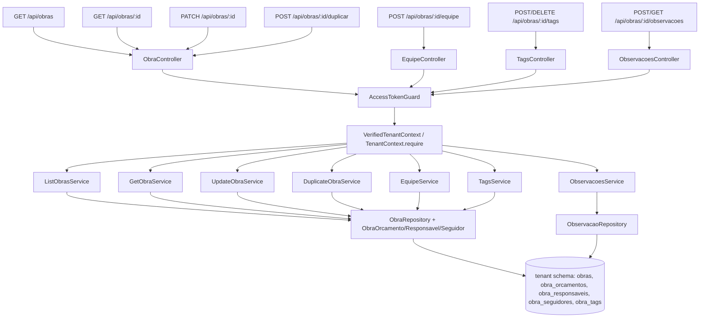

# Obras Gestão Completa Design

**Spec**: `.specs/features/obras_gestao_completa/spec.md`
**Status**: Approved

---

## Architecture Overview

Fase 1 fecha o agregado Obras sem sair da Clean/DDD já em uso: `controller → useCase (application) → repository (infra) → Tenant-scoped TypeORM`. Não há novo infra (S3, PDF, RLS). Cada história vira um `UseCase` tipado com `AsyncResult` + `left/right`, guard `AccessTokenGuard` + `TenantContext.require()` e tenant-scoped `DataSource.getRepository(...).query com schemaName` via `ObraRepository` já existente.



**Decisão vs alternativas**
- *Alternativa descartada A*: novo microserviço para Obras — rejeitado; legado é monolito tenant-scoped e Fase 1 não precisa partição.
- *Alternativa descartada B*: query builder raw fora do repo — rejeitado; violaria `mapper/toEntity` obrigatório e isolamento por schema.
- Escolhido: estender `ObrasModule` atual, manter `useFactory` + `Symbol` DI, sem `forwardRef`.

---

## Code Reuse Analysis

| Component | Location | How to Use |
|-----------|----------|------------|
| `TenantContext` + `VerifiedTenantContextService` | `src/core/multitenancy/*` | `require()` antes de qualquer repo; nunca aceitar `tenantId` do body |
| `PageEntity` / `PageMeta` / `PageOptions` | `src/core/pagination/*` | `GET /api/obras` retorna `Page<ObraResponseDto>` |
| `BaseModelPrimaryColumnUuid` | `src/core/interface/base_model.ts` | Novos models `ObraObservacaoModel`, `TagModel`, `ObraTagModel` |
| `ObraRepository`, `ObraModel`, `Obra*Model` | `src/modules/obras/infra/*` | Estender repo: `findPage`, `findOneWithRelations`, `updatePartial`, `duplicate` |
| `ObraEntity` factory + `fromData` | `src/modules/obras/domain/entities/obra.entity.ts` | Adicionar 20+ getters + `updatePartial(props)` sem quebrar `fromData` |
| `codigo_obra.service.ts` | `src/modules/obras/services/codigo_obra.service.ts` | Reusar geração `OBR-<ano>-NNNN` com retry 23505 |
| `AccessTokenGuard` + `AuthenticatedUser` | `src/modules/auth/controller/*` | Proteger todas as rotas novas |
| `ErrorCodeConstants` + `AppException` | `src/core/constants/error_code.constants.ts` | Novos códigos `OBRA_*` e `TAG_*`/`OBSERVACAO_*` |
| Legado `obra.entity.ts` / `obra-itens.entity.ts` / `cadastros.entity.ts` / `obras.enums.ts` | `obras_backend_legado/src/modules/obras/*` | Fonte da lista de colunas e enums |

### Integration Points

| System | Integration Method |
|--------|--------------------|
| Auth | `AccessTokenGuard` em cada controller; `RoleDecorator` não necessário (legado Fase1 usava `LER/ESCREVER` mas novo mapeia para qualquer tenant user autenticado — mantido simples) |
| Persistence | `DataSource` injetado + `TenantContext` para schema-qualified `manager.getRepository(Model).find` |
| Validation | DTOs `class-validator` no controller, `ValidationPipe { whitelist, forbidNonWhitelisted, transform }` global já habilitado |
| Errors | `left(new ObraServiceException({code, statusCode}))` → controller `throw new HttpException(result.value.message, statusCode)` |

---

## Components

### `ObrasModule` (extendido)

- **Purpose**: Agregar todos os use cases da Fase 1 e novos models.
- **Location**: `src/modules/obras/obras.module.ts`
- **Providers novos**: `LIST_OBRAS_SERVICE`, `GET_OBRA_SERVICE`, `UPDATE_OBRA_SERVICE`, `DUPLICATE_OBRA_SERVICE`, `EQUIPE_SERVICE`, `TAGS_SERVICE`, `OBSERVACOES_SERVICE` + `OBRA_OBSERVACAO_REPOSITORY` / `TAG_REPOSITORY`.

### `ListObrasService` / `GetObraService` / `UpdateObraService`

- **Interfaces**: `IListObrasUseCase`, `IGetObraUseCase`, `IUpdateObraUseCase` em `domain/usecase/`
- **Location**: `src/modules/obras/application/`
- **Responsabilidade**: `List` aplica filtros `status/tipo/orgaoId/q` + `PageOptions` via repo `findPage`; `Get` inclui `orcamentos/responsaveis/seguidores/tags/observacoes`; `Update` valida `subclassificacaoId` só se `tipo=OBRA`, impede `codigo` write, aplica `ObraEntity.updatePartial`.
- **Gate**: `isLeft() && NotFound → left(NotFound)`, `isLeft() && other → left(propagated)`.

### `DuplicateObraService`

- **Responsabilidade**: `findOneWithRelations` origem, `codigo_obra.service.generate(tenant, year)` com retry, `ObraEntity.create` + clona `obra_orcamentos` e `obra_responsaveis` (não clona `seguidores/observacoes/estagios/medicoes` — fora de escopo).
- **Gate**: origem `deletedAt != null` ou outro tenant → 404.

### `EquipeService` (`obra_responsaveis` + `obra_seguidores`)

- **Endpoints**: `POST /obras/:id/equipe/responsaveis`, `DELETE .../:relId`, `POST .../seguidores`, `DELETE .../:userId`, `GET ...`
- **Regras**: `usuarioId` deve existir no tenant (lookup em `users`), tipo `RESPONSAVEL|CORRESPONSAVEL`, idempotente (segundo POST mesmo `usuarioId` → 200 sem duplicar).

### `TagsService` (`tag` + `obra_tag`)

- **Endpoints**: `GET /obras/:id/tags`, `POST { tags: "a,b; c" }` (split por vírgula/;), `DELETE /obras/:id/tags/:tagId`
- **Regra**: tags são tenant-scoped, normalizadas `trim/lowercase`, `length 2..40`.

### `ObservacoesService`

- **Modelo**: `ObraObservacaoModel { id, tenantId, obraId, texto, criadoPorUsuarioId, createdAt }`
- **Endpoints**: `POST { texto }`, `GET`, `PATCH :obsId`, `DELETE :obsId`
- **Regra**: `texto` 1..2000, `criadoPorUsuarioId` do token, auditoria imutável de autor.

---

## Data Models

### `ObraModel` — estender (20+ colunas do legado, todas nullable/default)

```ts
@Column({type:'enum', enum:TipoFinanciamento, default:'SEM_OGU'}) tipoFinanciamento
@Column({type:'enum', enum:ModoDuracao, default:'DEFINIDO_PELO_USUARIO'}) modoDuracao
@Column({type:'date', nullable:true}) dataInicio: string|null
@Column({type:'date', nullable:true}) dataPrazo: string|null
@Column({type:'enum', enum:AcaoConveniada, default:'NAO'}) acaoConveniada
@Column({default:false}) prioritaria, exibirCameraAoVivo, privado, invisivel, considerarSabado, considerarDomingo, seguirAutomatico, vincularPagamentoPercentual, corresponsaveisPodemEditar
@Column({nullable:true}) cameraUrl: string|null
@Column({nullable:true}) programaPpa, acaoEstrategica, acaoOrcamentaria, unidadeMedida, secretario: string|null
@Column({type:'numeric', precision:18, scale:4, nullable:true}) quantidade: string|null // numeric como string (pg driver)
@Column({type:'date', nullable:true}) dataPactuada: string|null
@Column({nullable:true}) // subclassificacaoId/eixoId já existem
```

Enums novos em `src/modules/obras/domain/enums/` reutilizando `obras.enums.ts` legado: `TipoFinanciamento`, `ModoDuracao`, `AcaoConveniada`.

### `ObraEntity` props — estender

`ObraProps` ganha mesmos campos + `deletedAt`. `CreateObraProps` mantém compatibilidade (campos novos opcionais). Novo `UpdateObraProps = Partial<CreateObraProps>` + `status?: StatusObra`. `validate()` estende regra `subclassificacaoId → exigir tipo===OBRA`.

### Novos models tenant-scoped

- `TagModel { id, tenantId, nome, ativo, createdAt }` + `ObraTagModel { obraId, tagId }` (PK composta)
- `ObraObservacaoModel` acima — todos extendem `PrimaryColumn uuid` + `tenantId`.

Migration `1781210000000-obra_gestao_completa.ts`: `ALTER TABLE obras ADD COLUMN ...`, `CREATE TABLE tag`, `obra_tag`, `observacao` em cada schema via `TenantSchemaResolver` loop (padrão `localidades` migration).

---

## API Design

| Método | Rota | Auth | Descrição |
|--------|------|------|-----------|
| `GET` | `/api/obras?page&limit&status&tipo&orgaoId&q&sort=createdAt:DESC` | Bearer | Lista paginada tenant-scoped |
| `GET` | `/api/obras/:id` | Bearer | Detalhe com relações |
| `PATCH` | `/api/obras/:id` | Bearer | Parcial; bloqueia `codigo`; valida `subclassificacaoId` |
| `POST` | `/api/obras/:id/duplicar` | Bearer | Clona com novo código |
| `GET` | `/api/obras/:id/equipe/responsaveis` | Bearer | Lista equipe |
| `POST` | `/api/obras/:id/equipe/responsaveis { usuarioId, tipo }` | Bearer | Idempotente |
| `DELETE` | `/api/obras/:id/equipe/responsaveis/:relId` | Bearer | Remove vínculo |
| `GET/POST/DELETE` | `/api/obras/:id/equipe/seguidores` | Bearer | Seguidores idem |
| `GET` | `/api/obras/:id/tags` | Bearer | Lista tags da obra |
| `POST` | `/api/obras/:id/tags { tags }` | Bearer | Aplica (vírgula/;) |
| `DELETE` | `/api/obras/:id/tags/:tagId` | Bearer | Desvincula |
| `GET` | `/api/obras/:id/observacoes` | Bearer | Lista observações |
| `POST` | `/api/obras/:id/observacoes { texto }` | Bearer | Cria |
| `PATCH` | `/api/obras/:id/observacoes/:obsId` | Bearer | Edita texto |
| `DELETE` | `/api/obras/:id/observacoes/:obsId` | Bearer | Remove |

DTOs: `ListObrasQueryDto`, `UpdateObraDto extends PartialType(CreateObraDto) + @IsOptional @IsEnum(StatusObra) status`, `Duplicar: sem body`, `EquipeDto { @IsUUID usuarioId, @IsEnum(TipoResponsavel) tipo }`, `AplicarTagsDto { @IsString tags }`, `SalvarObservacaoDto { @IsString @MinLength(1) @MaxLength(2000) texto }`.

---

## Risks & Concerns

| Concern | Mitigation |
|---------|------------|
| `ObraRepository` atual faz `save` sem filtro de relações — Fase1 precisa carregar relações separadamente para `GET` detalhado | Novo método `findOneWithRelations` faz 4 queries tenant-scoped e monta via mapper, evita `relations` eager que quebra por schema |
| Concorrência `PATCH` + `PATCH` na mesma obra pode perder update | `last-write-wins` por `UPDATE ... WHERE id=:id` + `updatedAt` refresh; sem optimistic lock nesta fase (registrado para Fase 2) |
| `numeric(18,4)` chega como string do pg | Mapper mantém string; DTO valida `@IsNumberString()` e não converte para `number` para não perder precisão |
| Soft-delete `codigo` unicity | Índice legado `UQ_obra_codigo (tenantId,codigo)` deve virar partial `WHERE deletedAt IS NULL` na migration; enquanto não migra, `duplicate` e `create` verificam `deletedAt IS NULL` na query de colisão |
| Validação de `usuarioId` da equipe exige cross-module lookup | Injeta `IUserRepository` leitura-only via `UsersModule` export; se falhar, retorna 400 `OBRA_INVALID_USUARIO` |

---

## Error Codes (adicionar em `error_code.constants.ts`)

`OBRA_NOT_FOUND (404)`, `OBRA_INVALID_SUBCLASSIFICACAO (400)`, `OBRA_INVALID_STATUS_TRANSITION (400)`, `OBRA_CODE_COLLISION_RETRY_EXHAUSTED (500)`, `OBRA_REPOSITORY_FAILED (500)`, `OBRA_UPDATE_FAILED (400)`, `OBRA_DUPLICATE_FAILED (500)`, `OBRA_EQUIPA_INVALID_USUARIO (400)`, `OBRA_TAG_INVALID (400)`, `OBSERVACAO_NOT_FOUND (404)`, `OBSERVACAO_INVALID_TEXTO (400)`.

