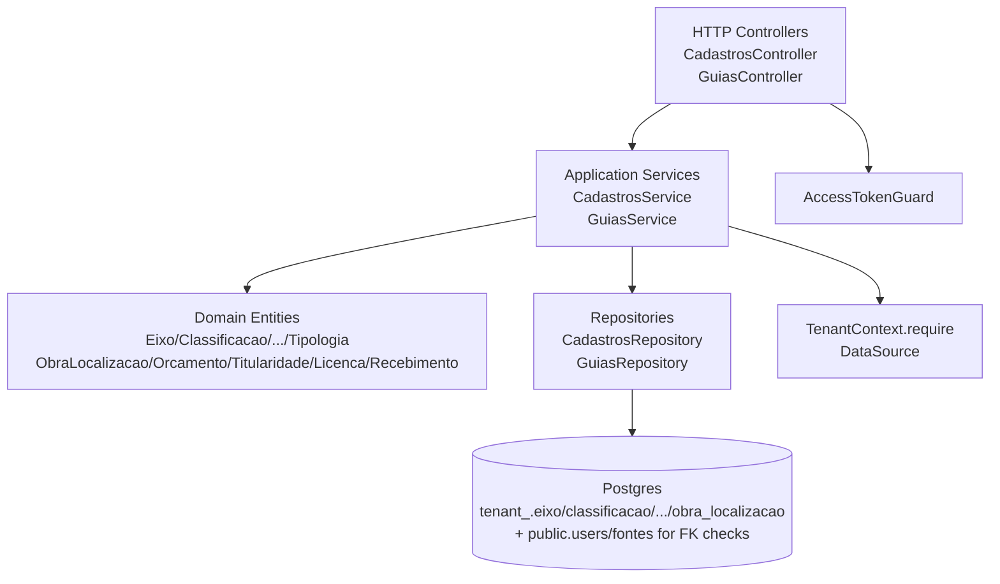

# Obras Guias e Cadastros Complementares Design

**Spec**: `.specs/features/obras_guias_cadastros/spec.md`
**Status**: Draft

---

## Architecture Overview

Complemento intra-agregado `Obras` que fecha a lacuna legado: cadastros configuráveis (Eixo/Classificacao/Subclassificacao/Tipologia/Subtipologia) e guias por obra (localizações, orçamentos, titularidade, licenças, recebimentos). Reusa o padrão tenant-schema já consolidado em `obras_gestao_completa`: `DataSource + TenantContext.require().schemaName + SQL direto` com `Either`/`AsyncResult`, sem `EntityManager` do legado.



ObrasModule existente é estendido (novos providers/controllers), não criado módulo separado — mantém coesão do agregado e evita duplicar `TenantContext` wiring.

---

## Code Reuse Analysis

### Existing Components to Leverage

| Component | Location | How to Use |
| --- | --- | --- |
| `TenantContext` | `src/core/multitenancy/tenant_context.ts` | `tc.require().schemaName/tenantId` em todo repository; valida isolamento |
| `BaseModelPrimaryColumnUuid` | `src/core/interface/base_model.ts` | Estender novos `*Model` (id + created_at/updated_at) |
| `ObraEntity` + `validateCreate` | `src/modules/obras/domain/entities/obra.entity.ts` | Referência para `subclassificacaoId` rule; valida `obraId` existe antes de guias |
| `ObraRepository` pattern | `src/modules/obras/infra/repositories/obra.repository.ts` | Copiar padrão `cols + placeholders + INSERT ... ON CONFLICT + RETURNING` e `ds.query` com schema interpolado |
| `PageEntity/PageMetaEntity` | `src/core/pagination/domain/entities/` | Paginação de cadastros (`PageOptions` DTO) |
| `AccessTokenGuard` | `src/modules/auth/controller/access_token.guard.ts` | Proteger todas as novas rotas |
| `FonteModel` + `FONTE_REPOSITORY` | `src/modules/fontes/infra/models/fonte.model.ts` | Validar `fonteId` em orcamento via `SELECT FROM "<schema>".fontes` |
| `ErrorCodeConstants` | `src/core/constants/error_code.constants.ts` | Adicionar novos códigos `CADASTRO_*`, `GUIA_*` |
| `Either left/right + AsyncResult` | `src/core/types/` | Todos os repositories/services retornam `AsyncResult<AppException, R>` sem throw |
| Migration loop pattern | `src/core/database/migrations/1781210000000-obra_gestao_completa.ts` | `for (const t of tenancies) { await qr.query(CREATE TABLE IF NOT EXISTS "${s}"."...") }` |

### New Components Needed

| Component | Purpose | Location |
| --- | --- | --- |
| `EixoModel`, `ClassificacaoModel`, `SubclassificacaoModel`, `TipologiaModel`, `SubtipologiaModel` | Persistência cadastros tenant-scoped | `src/modules/obras/infra/models/cadastro.model.ts` (5 `@Entity` ou arquivo único) |
| `ObraLocalizacaoModel`, `ObraOrcamentoPrevistoModel`, `TitularidadeModel`, `LicencaModel`, `RecebimentoModel` | Persistência guias | `src/modules/obras/infra/models/guias.model.ts` |
| `CadastroMapper`, `GuiaMapper` | `toEntity/toModel` estáticos | `src/modules/obras/infra/mapper/` |
| `CadastrosRepository`, `GuiasRepository` | `DataSource+TenantContext` com `findPage/create/update/delete` | `src/modules/obras/infra/repositories/` |
| `ICadastrosRepository`, `IGuiasRepository` + UseCase contracts | Interfaces DDD | `src/modules/obras/adapters/` + `domain/usecase/` |
| `CadastrosService`, `GuiasService` | Application services (validação hierárquica, fonte lookup, upsert) | `src/modules/obras/application/` |
| `CadastrosController`, `GuiasController` | HTTP layer | `src/modules/obras/controller/` |
| `CriarCadastroDto`, `AtualizarCadastroDto`, `CriarLocalizacaoDto`, `CriarOrcamentoDto`, `SalvarTitularidadeDto`, `SalvarLicencaDto`, `SalvarRecebimentoDto` | DTOs com `class-validator` | `src/modules/obras/dtos/` |
| Migration | Cria 10 tabelas em cada tenant schema | `src/core/database/migrations/1781220000000-obras_guias_cadastros.ts` |

---

## Components and Interfaces

### 1. Domain Entities

**Location**: `src/modules/obras/domain/entities/cadastro.entity.ts` e `guias.entity.ts`

```ts
// Cadastros — 5 entidades leves com mesma shape
interface CadastroProps { id:string; tenantId:string; nome:string; ativo:boolean; createdAt:Date; updatedAt:Date }
class EixoEntity { private constructor(props: CadastroProps); static create(p:{tenantId,nome}): EixoEntity; static fromData(p:CadastroProps): EixoEntity; validate() { if(nome.trim().length<2) throw CadastroDomainException(CADASTRO_INVALID_NOME) } }
class ClassificacaoEntity // idem
class SubclassificacaoEntity { props: CadastroProps & { classificacaoId:string } // valida parentId uuid }
class TipologiaEntity
class SubtipologiaEntity { props: CadastroProps & { tipologiaId:string } }

// Guias
interface ObraLocalizacaoProps { id:string; tenantId:string; obraId:string; localidade:string; uf:string; latitude:string|null; longitude:string|null; createdAt:Date }
class ObraLocalizacaoEntity { static create(p:{tenantId,obraId,localidade,uf,latitude?,longitude?}): ObraLocalizacaoEntity // uf length 2 }
// ObraOrcamentoPrevistoProps { id, tenantId, obraId, fonteId, valor:string (numeric 18,2) }
class ObraOrcamentoPrevistoEntity { static create(...): valida valor >0 via regex ^\d+(\.\d{1,2})?$ }
// TitularidadeProps { id, tenantId, obraId, situacao: SituacaoTitularidade, tipo?, observacoes? }
class TitularidadeEntity // upsert semantics: 1 por obra
// LicencaProps { id, tenantId, obraId, situacao: SituacaoLicenca, tipo?, numero?, validade?, observacoes? }
// RecebimentoProps { id, tenantId, obraId, tipo: TipoRecebimento, data?, dataPrevista? }
```

Enums novos reutilizam legado: `SituacaoTitularidade (EXISTENTE|NAO_EXISTENTE)`, `SituacaoLicenca (EXISTENTE|NAO_EXISTENTE)`, `TipoRecebimento (PROVISORIO|DEFINITIVO|INAUGURACAO)` em `src/modules/obras/domain/enums/`.

### 2. Mappers

**Location**: `src/modules/obras/infra/mapper/cadastro.mapper.ts`, `guias.mapper.ts`

`abstract class CadastroMapper { static toEntity(model: EixoModel): EixoEntity; static toModel(entity: EixoEntity): Partial<EixoModel> }` — idem para cada cadastro (ou genérico com `as EixoModel`). `GuiaMapper` idem para 5 guias.

### 3. Repositories

**Location**: `src/modules/obras/infra/repositories/cadastros.repository.ts`, `guias.repository.ts`

Padrão idêntico a `ObraRepository`: constructor `(ds: DataSource, tc: TenantContext)`, métodos `AsyncResult`.

```
ICadastrosRepository:
  findPage(entity: 'eixo'|'classificacao'|... , params: { page, limit, apenasAtivos }): AsyncResult<..., PageEntity>
  findOne(id, entity): AsyncResult<..., CadastroEntity>
  save(entity): AsyncResult<..., CadastroEntity> // INSERT ... ON CONFLICT (id) DO UPDATE
  existsParent(tipologiaId/classificacaoId): AsyncResult<boolean>

IGuiasRepository:
  listLocalizacoes(obraId): AsyncResult<..., ObraLocalizacaoEntity[]>
  createLocalizacao(entity): AsyncResult<..., ObraLocalizacaoEntity> // valida obra exists (SELECT obras WHERE id AND deleted_at IS NULL)
  deleteLocalizacao(obraId, id): AsyncResult<void>
  listOrcamentos(obraId): ...
  createOrcamento(entity): // antes valida fonte exists no schema
  deleteOrcamento(obraId, id)
  getTitularidade(obraId): AsyncResult<..., TitularidadeEntity|null>
  upsertTitularidade(entity)
  listLicencas(obraId) / createLicenca / updateLicenca / deleteLicenca
  listRecebimentos(obraId) / createRecebimento / updateRecebimento / deleteRecebimento
```

Todas as queries usam `SELECT/INSERT INTO "${schema}"."<table>"` com `schema=tc.require().schemaName`.

### 4. Application Services

**Location**: `src/modules/obras/application/cadastros.service.ts`, `guias.service.ts`

```ts
class CadastrosService implements ICadastrosUseCase {
  constructor(private readonly repo: ICadastrosRepository) {}
  async executeListEixos(params: ListCadastrosParam): AsyncResult<..., PageEntity<EixoEntity>> // try/catch → left(ServiceException)
  // idem para classificacoes/subclassificacoes/tipologias/subtipologias
  // subclassificacao: antes de save, repo.existsParent(classificacaoId) else left(CADASTRO_PARENT_NOT_FOUND 404)
}

class GuiasService implements IGuiasUseCase {
  constructor(private readonly repo: IGuiasRepository, private readonly fonteRepo: IFonteRepository) {}
  // cada método: Entity.create() (throw DomainException → left), repo valida obra tenant (left 404), repo.save → right
}
```

### 5. Controllers

**Location**: `src/modules/obras/controller/cadastros.controller.ts`, `guias.controller.ts`

```ts
@Controller('api/cadastros')
@UseGuards(AccessTokenGuard)
class CadastrosController {
  constructor(@Inject(CADASTROS_SERVICE) private readonly svc: ICadastrosUseCase) {}
  @Get('eixos') async listEixos(@Query() dto: PageOptionsDto & { apenasAtivos?: boolean })
  @Post('eixos') async createEixo(@Body() dto: CriarCadastroDto) // dto valida @MinLength(2)
  @Patch('eixos/:id') async updateEixo(@Param('id', ParseUUIDPipe) id, @Body() dto: AtualizarCadastroDto)
  // ... classificacoes, subclassificacoes, tipologias, subtipologias
}

@Controller('api/obras/:obraId')
@UseGuards(AccessTokenGuard)
class GuiasController {
  @Get('localizacoes') listLocalizacoes(@Param('obraId') obraId)
  @Post('localizacoes') createLocalizacao(@Param('obraId') obraId, @Body() dto: CriarLocalizacaoDto)
  @Delete('localizacoes/:id') deleteLocalizacao(...)
  @Get('orcamentos') / @Post('orcamentos') / @Delete('orcamentos/:id')
  @Get('titularidade') / @Post('titularidade') // upsert
  @Get('licencas') / @Post('licencas') / @Patch('licencas/:id') / @Delete('licencas/:id')
  @Get('recebimentos') / @Post('recebimentos') / @Patch('recebimentos/:id') / @Delete('recebimentos/:id')
}
```

Cada handler: `const r = await svc.execute(...); if(r.isLeft()) throw new HttpException(r.value.message, r.value.statusCode, {cause:r.value.cause}); return r.value`.

---

## Data Models

### Cadastro Tables (tenant schema)

```sql
CREATE TABLE "${s}"."eixo" (
  "id" uuid PRIMARY KEY,
  "tenant_id" uuid NOT NULL,
  "nome" varchar NOT NULL,
  "ativo" boolean NOT NULL DEFAULT true,
  "created_at" timestamptz NOT NULL DEFAULT now(),
  "updated_at" timestamptz NOT NULL DEFAULT now()
);
CREATE INDEX "IDX_eixo_tenant" ON "${s}"."eixo" ("tenant_id");
-- classificacao, tipologia idem

CREATE TABLE "${s}"."subclassificacao" (
  "id" uuid PRIMARY KEY,
  "tenant_id" uuid NOT NULL,
  "classificacao_id" uuid NOT NULL REFERENCES "${s}"."classificacao"(id),
  "nome" varchar NOT NULL,
  "ativo" boolean NOT NULL DEFAULT true,
  "created_at" timestamptz NOT NULL DEFAULT now(),
  "updated_at" timestamptz NOT NULL DEFAULT now()
);

CREATE TABLE "${s}"."subtipologia" (
  "id" uuid PRIMARY KEY,
  "tenant_id" uuid NOT NULL,
  "tipologia_id" uuid NOT NULL REFERENCES "${s}"."tipologia"(id),
  "nome" varchar NOT NULL,
  "ativo" boolean NOT NULL DEFAULT true,
  "created_at" timestamptz NOT NULL DEFAULT now(),
  "updated_at" timestamptz NOT NULL DEFAULT now()
);
```

### Guias Tables (tenant schema)

```sql
CREATE TABLE "${s}"."obra_localizacao" (
  "id" uuid PRIMARY KEY,
  "tenant_id" uuid NOT NULL,
  "obra_id" uuid NOT NULL REFERENCES "${s}"."obras"(id),
  "localidade" varchar NOT NULL,
  "uf" varchar(2) NOT NULL,
  "latitude" numeric(10,7),
  "longitude" numeric(10,7),
  "created_at" timestamptz NOT NULL DEFAULT now()
);
CREATE INDEX "IDX_localizacao_obra" ON "${s}"."obra_localizacao" ("obra_id");

CREATE TABLE "${s}"."obra_orcamento_previsto" (
  "id" uuid PRIMARY KEY,
  "tenant_id" uuid NOT NULL,
  "obra_id" uuid NOT NULL REFERENCES "${s}"."obras"(id),
  "fonte_id" uuid NOT NULL,
  "valor" numeric(18,2) NOT NULL,
  "created_at" timestamptz NOT NULL DEFAULT now()
);

CREATE TABLE "${s}"."titularidade" (
  "id" uuid PRIMARY KEY,
  "tenant_id" uuid NOT NULL,
  "obra_id" uuid NOT NULL UNIQUE REFERENCES "${s}"."obras"(id),
  "situacao" varchar NOT NULL, -- EXISTENTE|NAO_EXISTENTE
  "tipo" varchar,
  "observacoes" text,
  "created_at" timestamptz NOT NULL DEFAULT now(),
  "updated_at" timestamptz NOT NULL DEFAULT now()
);

CREATE TABLE "${s}"."licenca" (
  "id" uuid PRIMARY KEY,
  "tenant_id" uuid NOT NULL,
  "obra_id" uuid NOT NULL REFERENCES "${s}"."obras"(id),
  "situacao" varchar NOT NULL,
  "tipo" varchar, "numero" varchar, "validade" date, "observacoes" text,
  "created_at" timestamptz NOT NULL DEFAULT now(),
  "updated_at" timestamptz NOT NULL DEFAULT now()
);

CREATE TABLE "${s}"."recebimento" (
  "id" uuid PRIMARY KEY,
  "tenant_id" uuid NOT NULL,
  "obra_id" uuid NOT NULL REFERENCES "${s}"."obras"(id),
  "tipo" varchar NOT NULL, -- PROVISORIO|DEFINITIVO|INAUGURACAO
  "data" date, "data_prevista" date,
  "created_at" timestamptz NOT NULL DEFAULT now(),
  "updated_at" timestamptz NOT NULL DEFAULT now()
);
```

Model classes extend `BaseModelPrimaryColumnUuid` e mapeiam `tenant_id → tenantId`, `obra_id → obraId`, etc. via `@Column({ name: ... })`.

---

## API Design

| Método | Rota | Auth | Body | Descrição |
|--------|------|------|------|-----------|
| `GET` | `/api/cadastros/eixos?page&limit&apenasAtivos` | Bearer | — | Lista paginada eixos |
| `POST` | `/api/cadastros/eixos` | Bearer | `{ nome }` | Cria eixo |
| `PATCH` | `/api/cadastros/eixos/:id` | Bearer | `{ nome?, ativo? }` | Atualiza/desativa |
| `GET` | `/api/cadastros/classificacoes` | Bearer | — | Lista classificacoes |
| `POST` | `/api/cadastros/classificacoes` | Bearer | `{ nome }` | Cria |
| `PATCH` | `/api/cadastros/classificacoes/:id` | Bearer | `{ nome?, ativo? }` | Atualiza |
| `GET` | `/api/cadastros/classificacoes/:classificacaoId/subclassificacoes` | Bearer | — | Lista filhas |
| `POST` | `/api/cadastros/classificacoes/:classificacaoId/subclassificacoes` | Bearer | `{ nome }` | Cria filha |
| `PATCH` | `/api/cadastros/subclassificacoes/:id` | Bearer | `{ nome?, ativo? }` | Atualiza filha |
| `GET` | `/api/cadastros/tipologias` | Bearer | — | Lista tipologias |
| `POST` | `/api/cadastros/tipologias` | Bearer | `{ nome }` | Cria |
| `PATCH` | `/api/cadastros/tipologias/:id` | Bearer | `{ nome?, ativo? }` | Atualiza |
| `GET` | `/api/cadastros/tipologias/:tipologiaId/subtipologias` | Bearer | — | Lista filhas |
| `POST` | `/api/cadastros/tipologias/:tipologiaId/subtipologias` | Bearer | `{ nome }` | Cria filha |
| `PATCH` | `/api/cadastros/subtipologias/:id` | Bearer | `{ nome?, ativo? }` | Atualiza filha |
| `GET` | `/api/obras/:obraId/localizacoes` | Bearer | — | Lista localizacoes obra |
| `POST` | `/api/obras/:obraId/localizacoes` | Bearer | `{ localidade, uf, latitude?, longitude? }` | Cria |
| `DELETE` | `/api/obras/:obraId/localizacoes/:id` | Bearer | — | Remove |
| `GET` | `/api/obras/:obraId/orcamentos` | Bearer | — | Lista orcamentos |
| `POST` | `/api/obras/:obraId/orcamentos` | Bearer | `{ fonteId, valor }` | Cria |
| `DELETE` | `/api/obras/:obraId/orcamentos/:id` | Bearer | — | Remove |
| `GET` | `/api/obras/:obraId/titularidade` | Bearer | — | Get titularidade |
| `POST` | `/api/obras/:obraId/titularidade` | Bearer | `{ situacao, tipo?, observacoes? }` | Upsert |
| `GET` | `/api/obras/:obraId/licencas` | Bearer | — | Lista licencas |
| `POST` | `/api/obras/:obraId/licencas` | Bearer | `{ situacao, tipo?, numero?, validade?, observacoes? }` | Cria |
| `PATCH` | `/api/obras/:obraId/licencas/:id` | Bearer | `{ situacao?, tipo?, ... }` | Atualiza |
| `DELETE` | `/api/obras/:obraId/licencas/:id` | Bearer | — | Remove |
| `GET` | `/api/obras/:obraId/recebimentos` | Bearer | — | Lista recebimentos |
| `POST` | `/api/obras/:obraId/recebimentos` | Bearer | `{ tipo, data?, dataPrevista? }` | Cria |
| `PATCH` | `/api/obras/:obraId/recebimentos/:id` | Bearer | `{ tipo?, data?, ... }` | Atualiza |
| `DELETE` | `/api/obras/:obraId/recebimentos/:id` | Bearer | — | Remove |

DTOs:

```ts
class CriarCadastroDto { @IsString() @MinLength(2) nome: string }
class AtualizarCadastroDto { @IsOptional() @IsString() @MinLength(2) nome?: string; @IsOptional() @IsBoolean() ativo?: boolean }
class CriarLocalizacaoDto { @IsString() localidade: string; @IsString() @Length(2,2) uf: string; @IsOptional() @IsNumberString() latitude?: string; @IsOptional() @IsNumberString() longitude?: string }
class CriarOrcamentoDto { @IsUUID() fonteId: string; @IsNumberString() valor: string }
class SalvarTitularidadeDto { @IsEnum(SituacaoTitularidade) situacao: SituacaoTitularidade; @IsOptional() @IsString() tipo?: string; @IsOptional() @IsString() observacoes?: string }
class SalvarLicencaDto { @IsEnum(SituacaoLicenca) situacao; @IsOptional() @IsString() tipo?; @IsOptional() @IsString() numero?; @IsOptional() @IsString() validade?; @IsOptional() @IsString() observacoes? }
class SalvarRecebimentoDto { @IsEnum(TipoRecebimento) tipo; @IsOptional() @IsString() data?; @IsOptional() @IsString() dataPrevista? }
```

---

## Risks & Concerns

| Concern | Mitigation |
|---------|------------|
| Herança `subclassificacao → classificacao` com FK cruzada por schema | Repository valida `SELECT id FROM "${schema}"."classificacao" WHERE id=$1 AND tenant_id=$2` antes de insert; FK também garante integridade no DB |
| `valor` numeric(18,2) como string (pg driver retorna string) | DTO valida `@IsNumberString()` + regex `^\d+(\.\d{1,2})?$`; mapper mantém string, nunca converte para number |
| `fonteId` cross-schema lookup pode vazar tenant | Query sempre com `tenant_id = $2` (caller tenant); se não achar → 422 `FONTE_NOT_FOUND` |
| Titularidade UNIQUE(obra_id) upsert race | `INSERT ... ON CONFLICT (obra_id) DO UPDATE SET situacao=EXCLUDED...` atomico |
| Cadastros com `ativo=false` ainda referenciados por obra existente | Não cascatear; obra permanece legível; validação de `subclassificacaoId` em obra criação só exige parent `ativo=true` via check, mas obra antiga não quebra |
| Migration precisa rodar em N schemas existentes | Loop sobre `tenancies` como `1781210000000`, com `IF NOT EXISTS`; adicionar `down` simétrico |
| Soft-delete obra bloqueia guias | Todo método guias inicia com `SELECT id FROM "${schema}"."obras" WHERE id=$1 AND deleted_at IS NULL`; se vazio → 404 `OBRA_NOT_FOUND` |
| Testes de integração com `DataSource.query` schema interpolado | Usar `test/utils/tenant_test_helper.ts` já existente (cria tenant + schema + migra); mocks `jest.Mocked<DataSource>` com `query.mockResolvedValue` para unit |

---

## Error Codes (adicionar em `src/core/constants/error_code.constants.ts`)

```
CADASTRO_NOT_FOUND = 'CADASTRO_NOT_FOUND' (404)
CADASTRO_PARENT_NOT_FOUND = 'CADASTRO_PARENT_NOT_FOUND' (404)
CADASTRO_INVALID_NOME = 'CADASTRO_INVALID_NOME' (400)
CADASTRO_REPOSITORY_FAILED = 'CADASTRO_REPOSITORY_FAILED' (500)
OBRA_NOT_FOUND = 'OBRA_NOT_FOUND' (404) // já existe, reutilizar
FONTE_NOT_FOUND = 'FONTE_NOT_FOUND' (422)
GUIA_INVALID_INPUT = 'GUIA_INVALID_INPUT' (400)
GUIA_INVALID_ENUM = 'GUIA_INVALID_ENUM' (400)
GUIA_NOT_FOUND = 'GUIA_NOT_FOUND' (404)
GUIA_REPOSITORY_FAILED = 'GUIA_REPOSITORY_FAILED' (500)
TITULARIDADE_NOT_FOUND = 'TITULARIDADE_NOT_FOUND' (404)
LICENCA_NOT_FOUND = 'LICENCA_NOT_FOUND' (404)
RECEBIMENTO_NOT_FOUND = 'RECEBIMENTO_NOT_FOUND' (404)
```

---

## Module Wiring

Estender `src/modules/obras/symbols.ts` com `CADASTROS_REPOSITORY, CADASTROS_SERVICE, GUIAS_REPOSITORY, GUIAS_SERVICE`.

Em `src/modules/obras/obras.module.ts`:

```ts
TypeOrmModule.forFeature([EixoModel, ClassificacaoModel, SubclassificacaoModel, TipologiaModel, SubtipologiaModel, ObraLocalizacaoModel, ObraOrcamentoPrevistoModel, TitularidadeModel, LicencaModel, RecebimentoModel]),
providers: [
  { provide: CADASTROS_REPOSITORY, inject: [DataSource, TenantContext], useFactory: (ds, tc) => new CadastrosRepository(ds, tc) },
  { provide: GUIAS_REPOSITORY, inject: [DataSource, TenantContext], useFactory: (ds, tc) => new GuiasRepository(ds, tc) },
  { provide: CADASTROS_SERVICE, inject: [CADASTROS_REPOSITORY], useFactory: (r) => new CadastrosService(r) },
  { provide: GUIAS_SERVICE, inject: [GUIAS_REPOSITORY, FONTE_REPOSITORY], useFactory: (r,f) => new GuiasService(r,f) },
],
controllers: [ObraController, CadastrosController, GuiasController, EquipeController, TagsController, ObservacoesController],
```

## Decisions (AD)

Nenhuma nova AD necessária — conforma AD-001 (single DataSource + TenantContext), AD-002 (schemaName).

