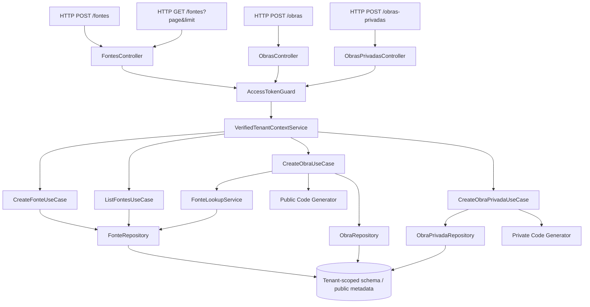

# Obras Públicas e Privadas Design

**Spec**: `.specs/features/obras_publicas_privadas/spec.md`
**Status**: Draft

---

## Architecture Overview

A feature will be implemented as three tenant-scoped flows that share the same tenant-verification and error-handling foundation, but use separate domain models, DTOs, repositories, and sequence generators where needed.

- Budget sources live in a `financeiro` module and support creation plus paginated listing for selection in public-work forms.
- Public works live in a `obras` module and persist the canonical public-work aggregate.
- Private works live in a `obras-privadas` module and persist the private-work aggregate with its property and situation fields.
- Both flows resolve the tenant from `VerifiedTenantContextService`, never from a caller-controlled tenant field.
- Both flows generate tenant-year codes inside the repository/service transaction path and retry on unique-key collisions.



## Code Reuse Analysis

### Existing Components to Leverage

| Component | Location | How to Use |
| --- | --- | --- |
| Tenant verification flow | `src/core/multitenancy/verified_tenant_context.service.ts` | Resolve the authenticated tenant before any persistence or code generation. |
| Request tenant storage | `src/core/multitenancy/tenant_context.ts` | Hold the verified tenant during the request scope. |
| Base TypeORM UUID model | `src/core/interface/base_model.ts` | Extend the base model shape for new persistence models. |
| Application error contract | `src/core/exceptions/app_exception.ts` | Return typed failures instead of throwing from services and repositories. |
| Error-code registry | `src/core/constants/error_code.constants.ts` | Add new work-domain error codes there before implementing exceptions. |
| JWT guard | `src/modules/auth/controller/access_token.guard.ts` | Protect both creation routes with the existing access-token guard. |
| Authenticated payload decorator | `src/modules/auth/controller/authenticated_user.decorator.ts` | Pass the access token payload into use cases when needed for creator metadata. |
| User role enum | `src/modules/users/domain/enums/user_role.enum.ts` | Preserve the existing role-based tenant-access model. |
| Public user model pattern | `src/modules/users/infra/models/user.model.ts` | Reuse the same TypeORM conventions, index style, and schema annotation style. |
| Legacy public-work behavior | `/home/vini/Desktop/obras/obras_backend_legado/src/modules/obras/*` | Use as the behavioral reference for DTO shape, code generation, and validation edges. |
| Legacy fonte behavior | `/home/vini/Desktop/obras/obras_backend_legado/src/modules/financeiro/*` | Use as the behavioral reference for fonte creation, active lookup, duplicate code handling, and listing order. |
| Legacy private-work behavior | `/home/vini/Desktop/obras/obras_backend_legado/src/modules/obras-privadas/*` | Use as the behavioral reference for private-work creation and initial state rules. |

### Integration Points

| System | Integration Method |
| --- | --- |
| Access control | `JwtAuthGuard` plus verified tenant context before service execution. |
| Persistence | New TypeORM models and repositories, following the existing `useFactory` DI style. |
| Migrations | One migration for fonte, public-work, private-work, and budget tables with their unique indexes, aligned with the current DataSource pipeline. |
| Validation | DTOs with `class-validator` and `class-transformer` at the HTTP boundary. |
| Error reporting | Domain, service, and repository exceptions mapped to registered codes and `HttpException` in controllers. |

## Components

### `FinanceiroModule`

- **Purpose**: Own budget-source creation, paginated listing, and active-source lookup for public-work budgets.
- **Location**: `src/modules/financeiro/`
- **Interfaces**:
  - `ICreateFonteUseCase.execute(param: CreateFonteParam): AsyncResult<AppException, FonteResponse>`
  - `IListFontesUseCase.execute(param: ListFontesParam): AsyncResult<AppException, PaginatedFonteResponse>`
  - `IFonteLookupService.validateActiveFonte(fonteId: string): AsyncResult<AppException, FonteEntity>`
- **Dependencies**: Verified tenant context, fonte repository, pagination DTOs.
- **Reuses**: Existing module wiring, symbol DI, and the legacy `FonteLookupService` behavior.

### `FonteEntity`

- **Purpose**: Represent a tenant-scoped budget source used by public-work budgets.
- **Location**: `src/modules/financeiro/domain/entities/fonte.entity.ts`
- **Interfaces**:
  - `static create(props: CreateFonteProps): FonteEntity`
  - `static fromData(props: FonteProps): FonteEntity`
- **Dependencies**: Domain validators for `nome`, optional type enum, optional numeric string value, and active default.
- **Reuses**: Current static factory conventions and legacy fonte field rules.

### `CreateFonteService`

- **Purpose**: Create active budget sources inside the authenticated tenant.
- **Location**: `src/modules/financeiro/application/create_fonte.service.ts`
- **Interfaces**:
  - Implements `ICreateFonteUseCase`
- **Dependencies**: Fonte repository and duplicate-code check.
- **Reuses**: `CreateUserService` style for duplicate lookup, `left/right`, and service exceptions.

### `ListFontesService`

- **Purpose**: Return tenant-scoped fontes ordered by name with safe pagination metadata.
- **Location**: `src/modules/financeiro/application/list_fontes.service.ts`
- **Interfaces**:
  - Implements `IListFontesUseCase`
- **Dependencies**: Fonte repository and pagination parameter validation.
- **Reuses**: Existing read-use-case pattern from tenancy listing, extended with page metadata.

### `FonteRepository`

- **Purpose**: Persist fontes, detect duplicate codes, validate active references, and return paginated tenant-scoped lists.
- **Location**: `src/modules/financeiro/infra/repositories/fonte.repository.ts`
- **Interfaces**:
  - `findByCode(codigo: string): AsyncResult<AppException, FonteEntity>`
  - `findActiveById(fonteId: string): AsyncResult<AppException, FonteEntity>`
  - `findAllPaginated(query: FontePaginationQuery): AsyncResult<AppException, Paginated<FonteEntity>>`
  - `save(fonte: FonteEntity): AsyncResult<AppException, FonteEntity>`
- **Dependencies**: TypeORM model, mapper, tenant context, unique partial index on non-null code.
- **Reuses**: Repository try/catch to left/right pattern and mapper-only persistence.

### `ObrasModule`

- **Purpose**: Own the public-work creation contract, responsible-link persistence, budget persistence, optional follower creation, and obra-created event emission.
- **Location**: `src/modules/obras/`
- **Interfaces**:
  - `ICreateObraUseCase.execute(param: CreateObraParam): AsyncResult<AppException, CreateObraResponse>`
  - `IObraRepository.findByTenantYearCode(...)`
  - `IObraRepository.save(obra: ObraEntity)`
- **Dependencies**: Verified tenant context, obra repository, responsible repository, budget repository, follower repository, code generator, fonte lookup, validation DTOs.
- **Reuses**: Nest module wiring, DI by symbol, service-as-use-case pattern, base exception pattern.

### `ObrasPrivadasModule`

- **Purpose**: Own the private-work creation contract, property identity data, geolocation, derived initial state, and private-work persistence.
- **Location**: `src/modules/obras-privadas/`
- **Interfaces**:
  - `ICreateObraPrivadaUseCase.execute(param: CreateObraPrivadaParam): AsyncResult<AppException, CreateObraPrivadaResponse>`
  - `IObraPrivadaRepository.findByTenantYearCode(...)`
  - `IObraPrivadaRepository.save(obra: ObraPrivadaEntity)`
- **Dependencies**: Verified tenant context, repository adapter, private code generator, owner existence check, org/locality validation, validation DTOs.
- **Reuses**: The same controller/service/repository conventions as the public module.

### `ObraEntity`

- **Purpose**: Represent the public-work aggregate root with immutable generated code.
- **Location**: `src/modules/obras/domain/entities/obra.entity.ts`
- **Interfaces**:
  - `static create(props: CreateObraProps): ObraEntity`
  - `static fromData(props: ObraProps): ObraEntity`
- **Dependencies**: Domain validators for required fields, business rule checks for budget, type, default status, default behavior flags, and classification consistency.
- **Reuses**: The legacy public-work invariants and current domain factory conventions.

### `ObraPrivadaEntity`

- **Purpose**: Represent the private-work aggregate root with immutable code, owner, property identity, address, geolocation, schedule markers, and three orthogonal situation axes.
- **Location**: `src/modules/obras-privadas/domain/entities/obra_privada.entity.ts`
- **Interfaces**:
  - `static create(props: CreateObraPrivadaProps): ObraPrivadaEntity`
  - `static fromData(props: ObraPrivadaProps): ObraPrivadaEntity`
- **Dependencies**: Domain validators for description, UF, owner reference, address fields, optional geolocation, optional dates, optional situation enums, and initial alvará state.
- **Reuses**: The legacy private-work invariants and current domain factory conventions.

### `CreateObraService`

- **Purpose**: Orchestrate public-work creation, active fonte validation, generated code assignment, responsible-link persistence, budget persistence, optional follower creation, and event emission inside a tenant-safe execution path.
- **Location**: `src/modules/obras/application/create_obra.service.ts`
- **Interfaces**:
  - Implements `ICreateObraUseCase`
- **Dependencies**: Public repository, responsible repository, budget repository, follower repository, code generator, tenant context, user context, budget normalization, fonte lookup, event publisher.
- **Reuses**: Service error handling, `left/right` result flow, repository duplication-check pattern, and fonte active lookup.

### `ObraResponsavelEntity`

- **Purpose**: Represent the required responsible user link created with each public work.
- **Location**: `src/modules/obras/domain/entities/obra_responsavel.entity.ts`
- **Interfaces**:
  - `static createResponsible(props: CreateObraResponsavelProps): ObraResponsavelEntity`
- **Dependencies**: User reference validation and tenant context.
- **Reuses**: Legacy `TipoResponsavel.RESPONSAVEL` cardinality rule.

### `ObraOrcamentoPrevistoEntity`

- **Purpose**: Represent each public-work budget source and value pair.
- **Location**: `src/modules/obras/domain/entities/obra_orcamento_previsto.entity.ts`
- **Interfaces**:
  - `static create(props: CreateObraOrcamentoProps): ObraOrcamentoPrevistoEntity`
- **Dependencies**: Active fonte lookup and numeric-string value validation.
- **Reuses**: Legacy requirement that each obra has at least one orçamento.

### `ObraSeguidorEntity`

- **Purpose**: Represent the optional automatic follower created when `seguirAutomatico` is true.
- **Location**: `src/modules/obras/domain/entities/obra_seguidor.entity.ts`
- **Interfaces**:
  - `static create(props: CreateObraSeguidorProps): ObraSeguidorEntity`
- **Dependencies**: User reference validation and unique obra-user follower constraint.
- **Reuses**: Legacy `seguirAutomatico` behavior.

### `CreateObraPrivadaService`

- **Purpose**: Orchestrate private-work creation, owner validation, code assignment, address/property normalization, geolocation persistence, and derived initial state inside a tenant-safe execution path.
- **Location**: `src/modules/obras-privadas/application/create_obra_privada.service.ts`
- **Interfaces**:
  - Implements `ICreateObraPrivadaUseCase`
- **Dependencies**: Private repository, code generator, tenant context, owner existence check, optional organization/locality lookup, initial-state derivation.
- **Reuses**: The same service composition style used by `CreateUserService` and `CreateTenancyService`.

### `ObraRepository`

- **Purpose**: Persist and query public-work records and code collisions.
- **Location**: `src/modules/obras/infra/repositories/obra.repository.ts`
- **Interfaces**:
  - `findLastCodeByTenantYear(tenantId: string, year: number): AsyncResult<AppException, ObraEntity | null>`
  - `save(obra: ObraEntity): AsyncResult<AppException, ObraEntity>`
- **Dependencies**: TypeORM model, mapper, transaction context, unique index on tenant-year code.
- **Reuses**: Repository try/catch to left/right pattern and mapper-only persistence.

### `ObraItemRepositories`

- **Purpose**: Persist responsible, budget, and follower records created by the public-work service.
- **Location**: `src/modules/obras/infra/repositories/`
- **Interfaces**:
  - `saveResponsible(entity: ObraResponsavelEntity): AsyncResult<AppException, ObraResponsavelEntity>`
  - `saveBudget(entity: ObraOrcamentoPrevistoEntity): AsyncResult<AppException, ObraOrcamentoPrevistoEntity>`
  - `saveFollower(entity: ObraSeguidorEntity): AsyncResult<AppException, ObraSeguidorEntity>`
- **Dependencies**: TypeORM models and mappers for each item entity.
- **Reuses**: Mapper-only persistence and repository exception pattern.

### `ObraPrivadaRepository`

- **Purpose**: Persist and query private-work records, code collisions, property identity indexes, owner indexes, and geolocation indexes.
- **Location**: `src/modules/obras-privadas/infra/repositories/obra_privada.repository.ts`
- **Interfaces**:
  - `findLastCodeByTenantYear(tenantId: string, year: number): AsyncResult<AppException, ObraPrivadaEntity | null>`
  - `save(obra: ObraPrivadaEntity): AsyncResult<AppException, ObraPrivadaEntity>`
- **Dependencies**: TypeORM model, mapper, transaction context, unique index on tenant-year code, indexes on `tenantId + inscricaoImobiliaria`, `tenantId + proprietarioPessoaId`, and geolocation fields.
- **Reuses**: Same repository pattern as public works.

### `PublicWorkCodeService`

- **Purpose**: Generate the next public-work code and retry on unique collisions.
- **Location**: `src/modules/obras/services/codigo_obra.service.ts`
- **Interfaces**:
  - `generateCode(tenantId: string, year?: number): Promise<string>`
  - `withCollisionRetry<T>(fn: () => Promise<T>): Promise<T>`
- **Dependencies**: Repository query for the last code and knowledge of the current year.
- **Reuses**: The retry-on-23505 pattern already proven in the legacy service.

### `PrivateWorkCodeService`

- **Purpose**: Generate the next private-work code and retry on unique collisions.
- **Location**: `src/modules/obras-privadas/services/codigo_privado.service.ts`
- **Interfaces**:
  - `generateCode(tenantId: string, year?: number): Promise<string>`
  - `withCollisionRetry<T>(fn: () => Promise<T>): Promise<T>`
- **Dependencies**: Repository query for the last code and knowledge of the current year.
- **Reuses**: The legacy private-work code sequencing pattern.

### `CreateFonteDto` / `ListFontesDto` / `CreateObraDto` / `CreateObraPrivadaDto`

- **Purpose**: Define the HTTP boundary for fonte creation/listing and each work creation flow.
- **Location**: `src/modules/financeiro/dtos/`, `src/modules/obras/dtos/create_obra.dto.ts`, `src/modules/obras-privadas/dtos/create_obra_privada.dto.ts`
- **Interfaces**:
  - DTO classes only; no domain entities or models at the HTTP boundary.
- **Dependencies**: `class-validator`, `class-transformer`, Swagger decorators.
- **Reuses**: The validation style already used in the current `users` and `tenancy` DTOs.

### `FontesController` / `ObrasController` / `ObrasPrivadasController`

- **Purpose**: Receive HTTP requests, validate them, and map service failures to HTTP exceptions.
- **Location**: `src/modules/financeiro/controller/`, `src/modules/obras/controller/`, `src/modules/obras-privadas/controller/`
- **Interfaces**:
  - `POST /fontes`
  - `GET /fontes?page=&limit=`
  - `POST /obras`
  - `POST /obras-privadas`
- **Dependencies**: Access-token guard, use-case symbol injection, DTOs, and authenticated user context.
- **Reuses**: The current controller pattern that converts `left` values into `HttpException`.

## Data Models (if applicable)

### Public Work Model

```typescript
interface ObraModel {
  id: string;
  tenantId: string;
  codigo: string;
  nome: string;
  descricao: string | null;
  tipo: string;
  status: string;
  tipoFinanciamento: string;
  modoDuracao: string;
  dataInicio: string | null;
  dataPrazo: string | null;
  acaoConveniada: string;
  prioritaria: boolean;
  exibirCameraAoVivo: boolean;
  cameraUrl: string | null;
  privado: boolean;
  invisivel: boolean;
  considerarSabado: boolean;
  considerarDomingo: boolean;
  seguirAutomatico: boolean;
  vincularPagamentoPercentual: boolean;
  corresponsaveisPodemEditar: boolean;
  orgaoId: string;
  setorId: string | null;
  localidadeId: string | null;
  eixoId: string | null;
  classificacaoId: string | null;
  subclassificacaoId: string | null;
  tipologiaId: string | null;
  subtipologiaId: string | null;
  programaPpa: string | null;
  acaoEstrategica: string | null;
  acaoOrcamentaria: string | null;
  unidadeMedida: string | null;
  quantidade: string | null;
  secretario: string | null;
  dataPactuada: string | null;
  criadoPorUsuarioId: string;
  createdAt: Date;
  updatedAt: Date;
  deletedAt: Date | null;
}
```

**Relationships**: Tenant-scoped root row, with all foreign references stored as UUIDs only.

### Private Work Model

```typescript
interface ObraPrivadaModel {
  id: string;
  tenantId: string;
  codigo: string;
  descricao: string;
  observacoes: string | null;
  proprietarioPessoaId: string;
  orgaoId: string | null;
  inscricaoImobiliaria: string | null;
  matriculaRgi: string | null;
  cartorio: string | null;
  cep: string | null;
  logradouro: string;
  numero: string | null;
  complemento: string | null;
  bairro: string | null;
  localidadeId: string | null;
  uf: string;
  latitude: string | null;
  longitude: string | null;
  geoOrigem: string | null;
  situacaoAlvara: string;
  andamento: string | null;
  habiteSe: string | null;
  dataInicio: string | null;
  dataPrevistaConclusao: string | null;
  createdAt: Date;
  updatedAt: Date;
  deletedAt: Date | null;
}
```

**Relationships**: Tenant-scoped root row for private-work flows, with property identity, geolocation, schedule, and situation fields stored on the same aggregate.

### Private Work Index Model

```typescript
interface ObraPrivadaIndexModel {
  tenantId: string;
  codigo: string;
  inscricaoImobiliaria: string | null;
  proprietarioPessoaId: string;
  latitude: string | null;
  longitude: string | null;
}
```

**Relationships**: Used to enforce tenant-local lookup performance and duplicate-aware identity search.

### Public Work Budget Model

```typescript
interface ObraOrcamentoModel {
  id: string;
  obraId: string;
  fonteId: string;
  valor: string;
}
```

**Relationships**: One public work can carry one or more budget rows; the feature requires at least one item at creation time.

### Public Work Responsible Model

```typescript
interface ObraResponsavelModel {
  id: string;
  tenantId: string;
  obraId: string;
  usuarioId: string;
  tipo: 'RESPONSAVEL';
  createdAt: Date;
}
```

**Relationships**: Created together with the obra to record the required feeding/responsible user.

### Public Work Follower Model

```typescript
interface ObraSeguidorModel {
  id: string;
  tenantId: string;
  obraId: string;
  usuarioId: string;
  seguidoEm: Date;
}
```

**Relationships**: Created only when `seguirAutomatico` is true, using the same user chosen as `responsavelUsuarioId`.

### Fonte Model

```typescript
interface FonteModel {
  id: string;
  tenantId: string;
  nome: string;
  descricao: string | null;
  codigo: string | null;
  tipo: string | null;
  valorPrevisto: string | null;
  vigencia: string | null;
  ativo: boolean;
  createdAt: Date;
  updatedAt: Date;
}
```

**Relationships**: Tenant-scoped reference data reused by public-work budgets and other financial flows.

### Fonte Pagination Model

```typescript
interface PaginatedFonteModel {
  items: FonteModel[];
  page: number;
  limit: number;
  total: number;
  totalPages: number;
}
```

**Relationships**: Used by the listing endpoint to return tenant-scoped fontes in a stable order.

## Error Handling Strategy

| Error Scenario | Handling | User Impact |
| --- | --- | --- |
| Fonte missing required `nome` or with invalid length | DTO validation returns HTTP 400 with a registered code. | The fonte is not created. |
| Duplicate fonte `codigo` within the tenant | Repository returns HTTP 409. | The user must pick a different code or omit it. |
| Fonte listing pagination invalid | DTO validation returns HTTP 400. | The client must correct `page` or `limit`. |
| Fonte listing succeeds | Repository returns tenant-scoped items ordered by `nome` and includes pagination metadata. | The client can page through fontes for selection in public-work forms. |
| Missing required public-work field | DTO validation returns HTTP 400 with a registered code. | The work is not created. |
| Invalid `subclassificacaoId` combination | Domain/service validation returns HTTP 422. | The caller must correct the type selection. |
| Public-work orçamento uses inactive or foreign fonte | Fonte lookup returns HTTP 422 before obra persistence. | The work and all linked rows are not created. |
| Public-work responsible user is missing or foreign to tenant | Service/repository validation returns HTTP 422 or 404 before obra persistence. | The work and all linked rows are not created. |
| Public-work linked-row persistence fails | Service rolls back the creation unit of work and returns the repository failure. | No partial obra, budget, responsible, or follower data remains. |
| Missing or invalid private-work owner | Service returns HTTP 422 or 404 depending on the repository result. | The work is not created. |
| Private-work geolocation or identity fields fail validation | DTO validation returns HTTP 400 before any persistence. | The work is not created. |
| Private-work derived state conflicts with payload values | Entity/service normalization overrides contradictory input or rejects it as invalid. | The work is not created with inconsistent state. |
| Private-work persistence fails after code generation | Transaction rolls back and the code is not reused in the same write attempt. | The user can retry safely. |
| Sequence collision on code generation | Repository/service retries and then returns HTTP 409 if retries are exhausted. | The user can retry safely. |
| Tenant context absent | `VerifiedTenantContextService` rejects before persistence. | No write occurs outside the verified tenant. |

## Risks & Concerns

| Concern | Location (file:line) | Impact | Mitigation |
| --- | --- | --- | --- |
| No current work module exists in the new backend | `src/modules/` (feature gap) | Implementation can drift from the legacy contract if the module shape is improvised. | Keep the module layout aligned with the existing `users` and `tenancy` patterns, and use this design as the source of truth for scope. |
| Sequence generation depends on concurrent inserts | `src/modules/obras/services/codigo_obra.service.ts` and `src/modules/obras-privadas/services/codigo_privado.service.ts` | Duplicate code conflicts can surface under load. | Use the retry-on-unique-violation pattern already validated in the legacy services. |
| Tenant reference fields are UUID-only and not foreign keys to other contexts | `src/modules/obras/domain/entities/obra.entity.ts` and private counterpart | Bad UUIDs could pass validation but fail later at persistence time. | Validate existence in the service layer before save and map failures to 422/404. |
| Public-work budgets are nested data | `src/modules/obras/dtos/create_obra.dto.ts` | Payload validation can become brittle if nested DTOs are underspecified. | Use nested DTOs with `ValidateNested` and a single required-array constraint. |
| Public-work creation writes multiple linked rows | `src/modules/obras/application/create_obra.service.ts` | Partial persistence could leave a work without budget or responsible user. | Save obra, responsible, budgets, and optional follower in a single unit of work or transaction. |
| Fonte pagination parameters can drift from client expectations | `src/modules/financeiro/dtos/list_fontes.dto.ts` | Bad defaults can expose too much data or create unstable UX. | Enforce bounded `page` and `limit`, return explicit metadata, and keep ordering deterministic by `nome`. |
| Private-work initial state is partly derived | `src/modules/obras-privadas/domain/entities/obra_privada.entity.ts` | Conflicting payload values could make the state ambiguous. | Enforce the derived state in the entity or service and ignore contradictory caller input. |

## Tech Decisions (only non-obvious ones)

| Decision | Choice | Rationale |
| --- | --- | --- |
| Paginated fonte listing | Yes | The client needs a selectable source catalog for public-work creation without loading all records at once. |
| Public-work creation is transactional | Yes | The aggregate root, responsible link, budgets, and optional follower must be all-or-nothing. |
| Private-work creation is transactional | Yes | The root row, its normalized identity data, and its derived initial state must be written atomically. |
| Separate modules for public and private works | Yes | The two flows share infrastructure but diverge in domain rules and payload shape. |
| Sequence logic in service-owned helpers | Yes | Keeps the code-generation rule reusable without coupling it to HTTP controllers. |
| Do not expose `codigo` in create DTOs | Yes | The code is a derived identifier and must remain immutable. |
| Validate tenant ownership before code generation | Yes | Prevents generating or reserving sequence numbers for unauthorized writes. |
| Keep UUID references as IDs only | Yes | Matches the existing cross-module boundary style and avoids circular domain dependencies. |

> **Project-level decisions:** none added in this design. If a later task turns one of these into a lasting repository-wide convention, it should be promoted to `.specs/STATE.md` as a new `AD-NNN` entry.
